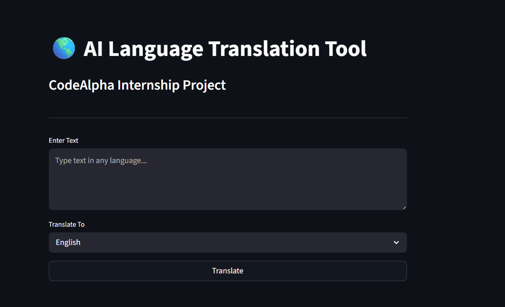
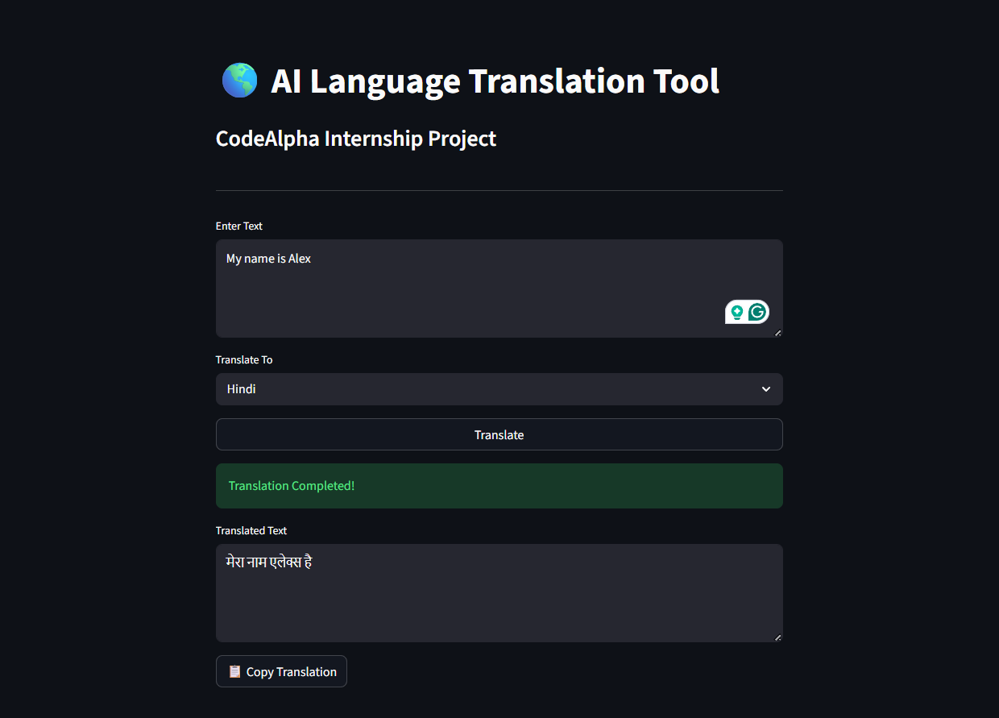

# 🌎 AI Language Translation Tool

A modern AI-powered Language Translation application developed using **Python**, **Streamlit**, and **Google Translator**.

The application automatically detects the input language and translates text into the user's selected language in real-time.

This project was developed as part of the **CodeAlpha Artificial Intelligence Internship Program**.

---

# 🚀 Features

* 🌐 Automatic Language Detection
* 🔄 Real-Time Translation
* 🌎 Multiple Language Support
* 📋 Copy Translation to Clipboard
* 🎨 Clean and Interactive UI
* ⚡ Fast and Lightweight
* 🤖 AI-Powered Translation

---

# 📸 Screenshots

## Home Screen



## Translation Output



---

# 🛠️ Tech Stack

| Technology      | Purpose                 |
| --------------- | ----------------------- |
| Python          | Core Programming        |
| Streamlit       | Frontend Interface      |
| deep-translator | Translation Engine      |
| Pyperclip       | Clipboard Functionality |

---

# 📂 Project Structure

```text
LanguageTranslationTool/
│
├── assets/
│   ├── home.png
│   └── translation.png
│
├── utils/
│   ├── __init__.py
│   ├── languages.py
│   └── translator.py
│
├── app.py
├── README.md
└── requirements.txt
```

---

# ⚙️ Installation

## Clone Repository

```bash
git clone https://github.com/YOUR_USERNAME/CodeAlpha_LanguageTranslationTool.git
```

## Navigate to Project Folder

```bash
cd CodeAlpha_LanguageTranslationTool
```

## Install Dependencies

```bash
pip install -r requirements.txt
```

## Run Application

```bash
streamlit run app.py
```

The application will open automatically in your browser.

---

# 📦 Dependencies

```txt
streamlit
deep-translator
pyperclip
```

---

# 🌍 Supported Languages

* English
* Hindi
* French
* German
* Spanish
* Italian
* Japanese
* Chinese
* Russian
* Arabic
* Portuguese
* Korean

---

# 🔄 Application Workflow

1. Enter text in any language.
2. Select the target language.
3. Click the Translate button.
4. The application automatically detects the source language.
5. Translation is generated instantly.
6. Copy the translated output if needed.

---

# 🎯 Future Enhancements

* 🎤 Speech-to-Text Translation
* 🔊 Text-to-Speech Output
* 🌙 Dark Mode Support
* 📜 Translation History
* 📄 Export Translation as PDF
* 🌎 Additional Language Support

---

# 📚 Learning Outcomes

This project helped in understanding:

* Translation APIs
* Natural Language Processing Concepts
* Python Application Development
* Streamlit Framework
* API Integration
* User Interface Design

---

# 🏆 Internship Information

Project Name:
**AI Language Translation Tool**

Organization:
**CodeAlpha**

Domain:
**Artificial Intelligence**

Task:
**Language Translation Tool**

---

# 👨‍💻 Author

### Akarsh Kumar

B.Tech Student | AI & Data Science Enthusiast

GitHub: https://github.com/AkarshKumar1

LinkedIn: https://www.linkedin.com/in/akarshkumar06/

---

# ⭐ Show Your Support

If you found this project useful, please consider giving it a ⭐ on GitHub.

It motivates further development and helps others discover the project.
